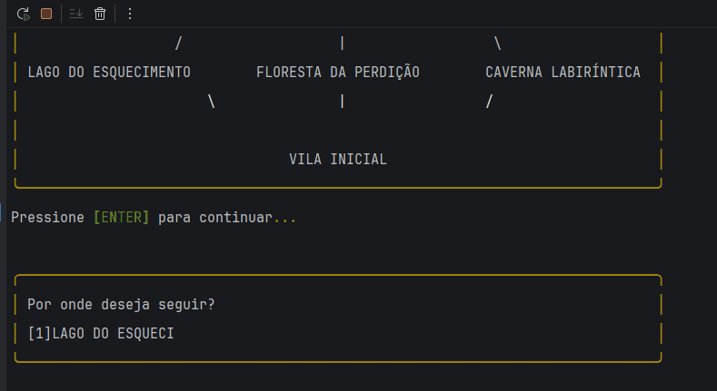
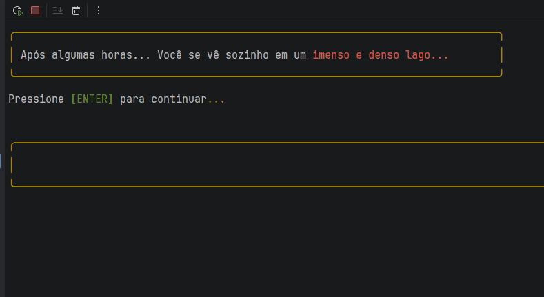

# RPG Terminal em Python

Um jogo RPG por texto desenvolvido em Python.

## Funcionalidades Atuais:
- Criação de personagem.
- Sistema de classes,
- Combate por turnos.
- Habilidades especiais.
- Sistema de efeitos.
- Inventário.
- Exploração.
- Aleatoriedade de eventos.
- Manipulação de Arquivos JSON.
- Conversa com NPCs através de I.A (usando modelo local via Ollama).


## Tecnologias:
- Python
- Programação Orientada a Objetos
- Git
- JSON.
- Inteligência Artificial (Ollama).

## Demonstração:
### Exploração e interações com NPC:


### Sistema de Combate:


### Video de Demonstração (Clique na Imagem):

[](https://www.youtube.com/watch?v=UXLYagjwYbA)

## Pré-Requisitos:
- Python 3.10 ou superior.
- Biblioteca Rich do Python.
- Ollama (https://ollama.com) instalado na máquina (necessário para interações com npcs).

## Como Executar:
- ### 1. Instale e ative o uso da biblioteca rich no seu IDE
- O processo varia de acordo com o IDE usado. No meu caso, como eu usei o Pycharm, você deve instalar a biblioteca usando
o comando:
```bash
   pip install rich
```
- Após a instalação, execute o arquivo main.py. É aconselhavel ativar a opção Emulate terminal in output console no Pycharm.

- ### 2. Configure o Ollama
As conversas com os NPCs usam um modelo de linguagem rodando **localmente** na sua máquina, sem precisar de internet ou chave de API.

1. Baixe e instale o Ollama em [ollama.com](https://ollama.com)
2. Baixe o modelo de inteligência artificial usado pelo projeto:
```bash
   ollama pull gemma3:4b
```

### 4. Rode o jogo
Execute o comando:
```bash
python main.py
```

**Nota:** se o Ollama não estiver rodando, o jogo continua funcional normalmente. Apenas as conversas com NPCs não vão 
funcionar, retornando um aviso em vez de travar o programa.

